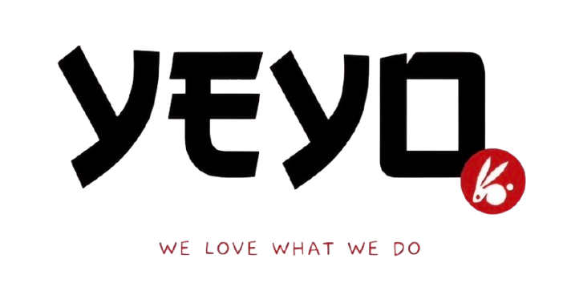

# Yeyo Maki 🍣



Una aplicación web moderna y elegante para **Yeyo Maki**, una marca de makis artesanales que fusiona la precisión japonesa con sabores peruanos auténticos ("Fusión nikkei. Alma peruana.").

Este proyecto está construido con una arquitectura moderna de frontend enfocada en el diseño estético, animaciones fluidas y una experiencia de usuario (UX) inmersiva.

## 🚀 Características Principales

- **Diseño Editorial y Moderno:** Layout inspirado en revistas de diseño japonés, con tipografías cuidadas y un fuerte enfoque estético.
- **Componentes Modulares:** Arquitectura de React bien estructurada (`src/components/`) para facilitar el mantenimiento y la escalabilidad.
- **Responsive Design:** Completamente adaptable a dispositivos móviles, tablets y pantallas grandes (Desktop).
- **Animaciones Personalizadas:** Elementos visuales dinámicos como pétalos cayendo (`Petals.tsx`), transiciones de aparición al hacer scroll (Intersection Observer) y un cursor personalizado (`CustomCursor.tsx`).
- **Scroll Horizontal en Móviles:** Sistema de pestañas de menú y lista de productos optimizados para la navegación táctil en celulares, evitando listas verticales excesivamente largas.
- **Datos Centralizados:** El menú (platos, precios, descripciones) se encuentra en un archivo separado (`src/data/menuData.ts`) para una fácil actualización.

## 🛠 Tecnologías Utilizadas

- **React** (Hooks, Funcionales Components)
- **Vite** (Bundler ultrarrápido)
- **TypeScript** (Tipado estricto para mayor seguridad en el código)
- **CSS Vanilla** (Estilos a medida utilizando variables CSS, animaciones con `@keyframes` y CSS Grid/Flexbox)

## 📁 Estructura del Proyecto

```text
YeyoMaki/
├── public/
│   └── assets/content/    # Imágenes, videos y recursos estáticos
├── src/
│   ├── components/        # Componentes UI reutilizables y modulares
│   │   ├── About.tsx
│   │   ├── CTASection.tsx
│   │   ├── CustomCursor.tsx
│   │   ├── Footer.tsx
│   │   ├── Hero.tsx
│   │   ├── Hours.tsx
│   │   ├── MenuSection.tsx
│   │   ├── Navbar.tsx
│   │   ├── Offers.tsx
│   │   └── SignatureSection.tsx
│   ├── data/
│   │   └── menuData.ts    # Datos estructurados del menú
│   ├── App.css            # Estilos globales y específicos del sitio
│   ├── App.tsx            # Componente raíz que ensambla la página
│   └── main.tsx           # Punto de entrada de la aplicación
├── package.json
├── tsconfig.json
└── vite.config.ts
```

## ⚙️ Instalación y Uso

Sigue estos pasos para correr el proyecto localmente:

1. **Clona el repositorio o abre la carpeta del proyecto** en tu terminal.
2. **Instala las dependencias**:
   ```bash
   npm install
   ```
3. **Inicia el servidor de desarrollo**:
   ```bash
   npm run dev
   ```
4. Abre tu navegador y ve a `http://localhost:5173/`.

## 📦 Construcción para Producción

Para compilar el proyecto y prepararlo para producción (minificado y optimizado), ejecuta:

```bash
npm run build
```

Los archivos estáticos generados se encontrarán en la carpeta `dist/`.

---

*We love what we do.* ❤️
